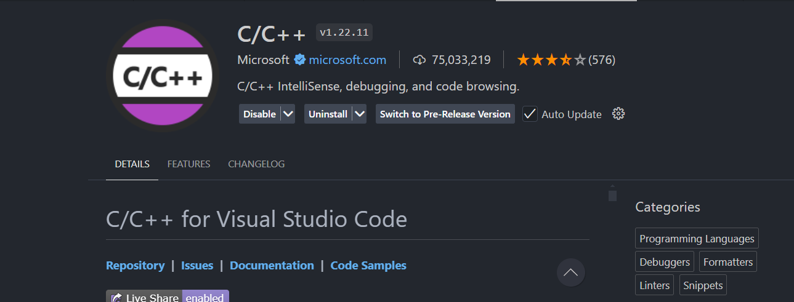
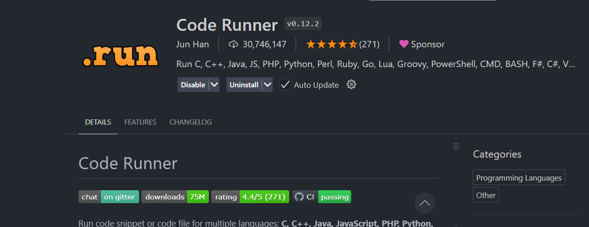
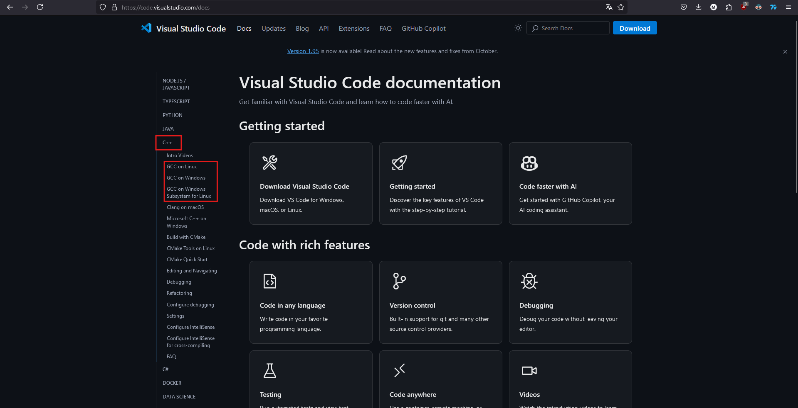
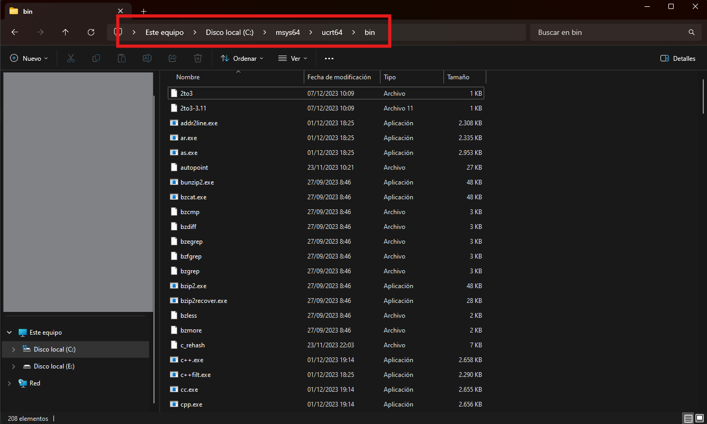
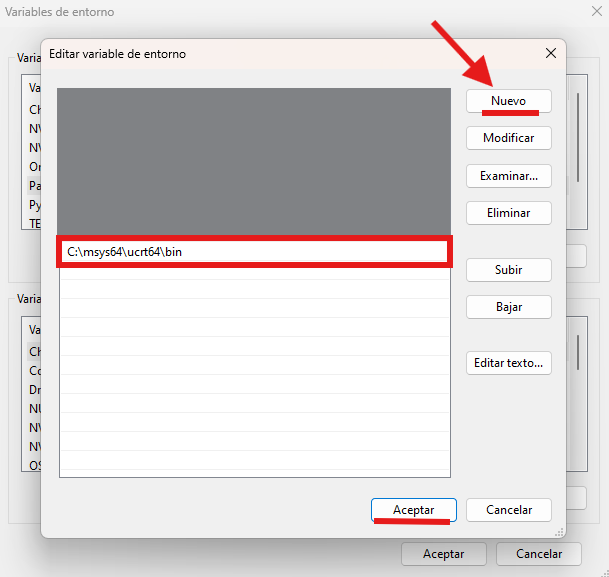
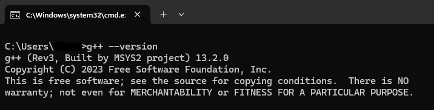
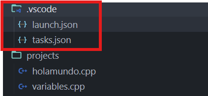

# **Setup Guide for Running C++ in Visual Studio Code**

This guide explains the steps to configure your C++ development environment in Visual Studio Code (VSC).

---

## **1. Install the Required Extensions**

1. **C/C++ Extension**  
   Install the official Microsoft C/C++ extension from the Visual Studio Code marketplace.  
   

2. **Code Runner**  
   Install the *Code Runner* extension to easily run your code.  
   

---

## **2. Download and Install the Compiler**

Follow the [official Visual Studio Code documentation](https://code.visualstudio.com/docs) to download and install the appropriate compiler for your operating system.

1. Download and install the compiler.  
   

2. **Compiler Path:**  
   After installation, locate the folder where the compiler is installed. In this example, the compiler is located in:  
   `C:\msys64\ucrt64\bin`

   

3. Copy this path for use in the next step.

---

## **3. Set Up Environment Variables**

1. Open the **System Environment Variables** window.
2. Look for the `Path` section.
3. Add the path you copied earlier (`C:\msys64\ucrt64\bin`).  
   

---

## **4. Verify the Installation**

You can verify that the compiler is correctly installed using two methods:

### **Option 1: Use the Windows Terminal**
1. Press `Windows + R`, type `cmd`, and press *Enter*.
2. Run the following command in the terminal:
   ```bash
   g++ --version
   ```
If everything is set up correctly, you should see output similar to this:



### **Option 2: Validate in a Visual Studio Code Project**

1. Create or open a project with a `.cpp` file.

2. Verify that a `.vscode` folder with `launch.json` and `tasks.json` files has been automatically generated.



---
